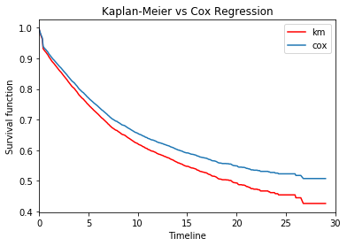

# Is age and cohort related to divorce?

#### Filipe F. Borba

Note: this project was made based on this [repository by Allen Downey](https://github.com/AllenDowney/MarriageNSFG).

Marriage is something that has been changing drastically in the past few decades. Allen Downey wrote in his blog that ["millennials are still not getting married"](http://allendowney.blogspot.com/2016/10/millennials-are-still-not-getting.html), with a compelling graph showing how the dynamics of marriages have been changing over time. However, with a difference in marriages, there must be a difference in divorces too, right?

This analysis uses data from the National Survey of Family Growth (NSFG) ranging from 2002 to 2017 cycles. The group selected was 17095 female respondents, which have been married at least once. This group was then divided into cohorts by decade of birth.

The goal of this project is to identify differences in divorces across cohorts using survival analysis with female respondents. Also, use Cox regression (or Cox's proportional hazard model) to fit a model with explanatory variables (called covariates) to verify how we can explain variation in divorce rates.

### Survival Analysis

As we know the distribution of durations of marriages, computing the survival curve is easy, because it is the complement of the CDF.
Here is the average survival curve regarding all respondents, without distinction of complete or ongoing marriages. With that, we can get a more broad idea of the divorce rate.


In this case, this survival curve is equal to the Kaplan-Meier estimator, because our dataset is made of only of respondents that were married at some point so we don't need to estimate anything. With this graph in mind, we can compare it to the survival curve divided by cohort.


Here we estimate the survival curves for each cohort without resampling. As we can see, there are some differences between them and limited curves for the 70s, 80s and 90s, which we will take care of later. There is substantial undersampling for 50s and 90s women, because there are much less respondents in this cohorts compared to others.
Initially, we can see that the 80s cohort was more likely to divorce sooner, while the 50s cohort survived more in the first few years then, at the end, had the least fraction still married.


Here we try to predict the outcome of the marriages by resampling the data of previous cohorts if needed. The grey area shows how much variation the data has with different samples with a 90% confidence interval. There is a lot of variation for the 90s indicated by the grey area, which makes us conclude that this data is not reliable for our results. So we can't draw any conclusions for the 90s cohort.

To get a more numeric view of how the fraction of women still married are dropping, we can use a percentage table as follows. The percentage table shows us the fraction of respondents still married after a certain period of time. This helps us visualize the difference between the groups in a more objective way. 

| Cohort/Fraction still maried after | 5 years | 15 years | 25 years |
| ----- | ----- | ----- | ----- |
| 50s | 80% | 57% | 42% |
| 60s | 78% | 59% | 53% |
| 70s | 78% | 60% | 51% |
| 80s | 76% | 62% | 54% |
| 90s | 63% | 53% | 48% |

As we can see, the 50s have the lowest fraction still married after 25 years. Also, the 90s has a low fraction after 5 years in comparison to the others. This has a high chance to be due to undersampling, which makes it hard to conclude things about the two groups.
On the other hand, the 60s, 70s and 80s curves apparently had a similar behavior, which makes us think that our conclusions towards these groups are more solid. Next, we try to understand which variables can affect divorces.

### Cox Regression

Cox regression (or Cox's proportional hazard model) is a method for investigating the effect of several variables upon the time a specified event takes to happen. It is very similar to a regression model, but for survival analysis.

The concordance-index evaluates the accuracy of the ordering of predicted time. 0.5 is the expected result from random predictions, 1.0 is perfect concordance and, 0.0 is perfect anti-concordance. Fitted survival models typically have a concordance index between 0.55 and 0.75 (this may seem bad, but even a perfect model has a lot of noise than can make a high score impossible).

The spread in the graph can be interpreted as how much "variance" is provided by the baseline hazard vs the partial hazard. If none of the variance is explained by the covariates (similar to explanatory variables), the baseline hazard is approximately equal to the Kaplan-Meier estimator. Deviations from this provide a visual measure of variance explained. A higher hazard means more at risk of the event occurring. 



By using only the ```agemarry``` variable for the Cox regression, there is a substantial spread from the Kaplan-Meier function and 0.63 concordance-index. ```agemarry``` has a coefficient of -0.10. This gives exp(-0.10)=0.9 - about a 10% decrease in the baseline hazard, which means less at risk of the event (divorce) ocurring. By adding ```birth_index``` (decade of birth) and ```age``` (age of respondent), the model wasn't very different than the one just using ```agemarry```.
With that, we can conclude that "age when first married" has a big impact in divorce rate. The more aged the woman is when first married the better, because it reduces the hazard of divorce by 10% per year for the model given. However, this conclusions are not very confident, the data is biased due to sampling errors. As more data is gathered, this effect will be less problematic, allowing us to have more precision in our estimates.


### Methodology

As presented before, this analysis uses NSFG data ranging from 2002 to 2017 cycles. 17095 female respondents, married at least once,  were divided into cohorts by decade of birth. 

There is a big sampling issue with this data, because the number of women per cohort are very different for each decade:

| Cohort | Number of respondents |
| ----- | ----- |
| 50s | 460 |
| 60s | 4417 |
| 70s | 7493 |
| 80s | 4208 |
| 90s | 517 |

With that being said, resampling is used to address this issue. In the figures, there is a grey area that represents a 90% confidence interval estimative. Also, to make the projection of marriages of limited groups, the hazard function of the previous cohort is used to estimate the behavior of the curve. This makes it likely for the function to underestimate how different the behavior of the given cohort will be from their predecessors.

Moreover, there is also some natural oversampling for respondents who married young, specially for the 90s cohort. This also affects the results and explorations. As more data is gathered, this effect will be less problematic, allowing us to have more precision in our estimates.

For more information about the methodology, check [this jupyter notebook](https://github.com/filipefborba/MarriageNSFG/blob/master/project2/project2.ipynb).

